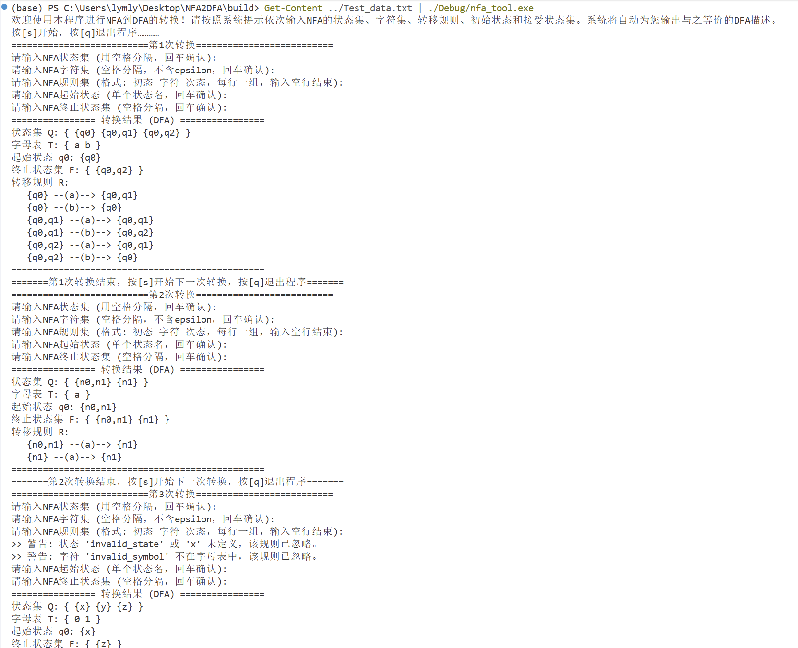
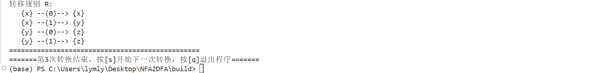

# 基于子集构造法的NFA到DFA转换程序的实现与分析

*完整项目文件已上传至[https://github.com/LLynn51/NFA_converter.git]。*

## 实验环境描述

- 操作系统：Windows 11 家庭中文版 25H2 （64 位操作系统, 基于 x64 的处理器）
- 语言：C++
- IDE：Visual Stdio Code
- 关键库：`<iostream>、<string>、<vector>、<set>、<map>、<set>、<queue>、<algorithm>、<sstream>`
- 编译器：MSVC (Microsoft Visual C++) 17.0 (随 VS 2022 提供)
- 构建工具：CMake 4.3.0
- 测试工具：PowerShell Pipeline (用于自动化流式输入测试)

## 设计思路和核心算法

### 数据结构

#### 为了提高代码的可读性与数学模型的一致性，我们将 STL 容器封装为对应自动机概念的类型别名：

| 逻辑概念 | 类型别名 | 符号表示 | 实现说明 |
| :--- | :--- | :--- | :--- |
| 状态标识 | `StateID` | $q \in Q$ | 使用 `int` 统一编号 |
| 输入符号 | `InputID` | $a \in \Sigma$ | 映射输入字符为整数编号 |
| 状态集合 | `StateID_sset` | $S \subseteq Q$ | 使用 `std::set` 保证元素唯一性且有序 |
| NFA 转移函数 | `Ns` | $\delta_{NFA}$ | `map` 套嵌套 `vector`：$Q \times (\Sigma \cup \{\epsilon\}) 	o 2^Q$ |
| DFA 转移函数 | `Ds` | $\delta_{DFA}$ | `map` 套 `map`：$Q' 	imes \Sigma 	o Q'$ |
| 幂集映射 | `Nss2D` | $f : 2^Q 	o Q'$ | 将 NFA 的状态子集映射为 DFA 的单一状态标识 |

#### 自动机实体结构

1. 将 NFA 和 DFA 抽象为结构化对象，完整维护其五元组 $(Q, \Sigma, \delta, q_0, F)$：
2. 状态映射器 (`dy_enum`)：实现字符串输入（如状态名 "q0", "start"）与内部数值计算之间的双向映射，将不确定的字符串转换为便于处理的整型序号；实现上下文携带，便于将程序内部的变量表示重新输出为已读的字符串。

### 核心算法

#### $\epsilon$ -闭包算法

用于寻找从给定状态集 $S$ 出发，仅通过 $\epsilon$ 转移能够到达的所有状态集合。

1. 初始化：结果集 `closure` = $S$，创建一个队列 `queue` 并将 $S$ 中所有元素入队。
2. 迭代：当队列不为空时：
    1. 弹出队首状态 $u$。
    2. 遍历 $u$ 在 NFA 转移函数中所有标记为 $\epsilon$ 的目标状态 $v$。
    3. 若 $v\notin closure$，则将 $v$ 加入 `closure` 并入队。
3. 返回：当没有新的状态可以加入时，返回 `closure`。

DFA convert_NFA_to_DFA(NFA nfa)：接收用户输入的整个NFA，然后从初始状态的空集闭包出发，遍历每个可以到达的状态，将它们加入新的状态集，并同步更新规则集；即将NFA通过子集构造法转换为DFA。（算法实现见converter.cpp）

#### 子集构造转换算法

模拟NFA在接收字符后的所有可能状态路径，构造等价的确定性状态。

1. 起始状态生成：计算 $q'_0 = \epsilon	ext{-closure}(q_0)$。将其作为 DFA 的起始状态。
2. 工作队列维护：创建一个队列 `work_list`，初始放入 $q'_0$。
3. 子集遍历：当 `work_list` 不为空时：
    1. 取出当前子集 $T$。
    2. 遍历字母表：对于字母表中的每个非 $\epsilon$ 字符 $a \in \Sigma$：
    3. 计算转移集合：$Move(T, a) = \bigcup_{s \in T} \delta(s, a)$。
    4. 计算闭包：$U = \epsilon\text{-closure}(Move(T, a))$。
    5. 新状态判定：若 $U$ 是从未见过的新集合，则为 $U$ 分配新的 `StateID`，并入队 `work_list`。
    6. 记录转移：在DFA转移函数中添加规则 $\delta_{DFA}(T, a) = U$。
4. 终止状态判定：对于生成的每一个DFA状态（即NFA状态子集），若该子集中包含任何一个原NFA的终止状态 $f \in F_{NFA}$，则将该子集对应的 DFA 状态标记为终止状态。

## 程序测试（输入、输出和执行效果）

本程序测试文件详见Test_data.txt，通过Get-Content ../Test_data.txt | ./Debug/nfa_tool.exe在控制台中实现自动化测试。用户也可在控制台输入指令./Debug/nfa_tool.exe，实现手动输入数据。

Test_data.txt的测试数据中，包含三个测试用例（在终端中分别体现为第1、2、3次转换。）：

1. 基础验证：普通不含$\epsilon$转移的NFA，验证状态分支。
2. 转移验证：包含起始状态带有$\epsilon$转移至终止状态的情况。若程序能正确识别{n0,n1} 这一复合状态为终止状态，便能证明闭包运算和终态判定逻辑的正确性。
3. 异常处理：输入不在字母表中的字符，验证程序的鲁棒性和警告处理机制的有效性。
测试结果如下：（输入并没有出现在终端中，这是由于输入来自文件Test_data.txt的重定向，并非手动输入，是正常现象。）

可以看到，转换结果正确无误。例如，在测试用例 2 中，NFA 存在 $q_0 \xrightarrow{\epsilon} q_{final}$ 的路径。程序运行结果显示，转换后的DFA起始状态自动包含了 $q_{final}$ 的属性。这证明了 `get_epsilon_closure` 算法在处理转换初始步时，能够正确识别空字到达的接受状态，符合理论预期。

## 改进方向和未来展望

1. 目前程序仅能通过命令行交互，不够便捷。计划未来为程序设计图形化界面。
2. 目前程序只能在windows系统上运行，兼容性不好。计划在未来进行针对Linux等系统的兼容。
3. 目前程序仅能输出转换结果，没有转换过程，可解释性不好。计划未来设计使得程序能够输出详细的过程解释。
4. 目前生成的DFA包含等价状态，未来可引入Hopcroft算法或Moore算法进行状态压缩。
